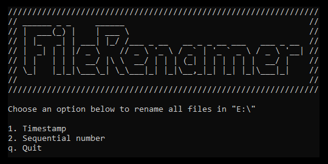

# FileRenamer



## Table of contents

- [What is it?](#what)
- [Setup and usage](#setup)
- [Technologies](#technologies)
- [Acknowledgments](#acknowledgments)

<a name="what"></a>
## What is it? 

Renames all files within the current working directory (as well as any files in any child directories).

There are two modes:

### 1. Timestamp mode

Takes the current system time (as a Unix timestamp in milliseconds) and increments the value by 1 so that every file has a unique name.

**Example**
```
CurrentDir
|-> 1584802593285
|-> 1584802593286
|-> 1584802593287
|-> ChildDir1
    |-> 1584802593288
    |-> 1584802593289
|-> ChildDir2
    |-> 1584802593290
    |-> 1584802593291
```

### 2. Sequential mode

Starts at 1 and increments by 1 for every file in the current directory. Every child directory also starts at 1.

**Example**
```
CurrentDir
|-> 1
|-> 2
|-> 3
|-> ChildDir1
    |-> 1
    |-> 2
|-> ChildDir2
    |-> 1
    |-> 2
```

<a name="setup"></a>
## Setup and usage

Runs as a standalone .exe.

Suggested usage is to put the .exe in a folder of your choice and set up a system path to it.

Then run ```filerenamer``` from your command line.

When the program loads, you'll be given the option to select the rename mode.

### !!! Warning !!!

***Make sure you are in the correct working directory before you run the program.***

### Optional command line arguments

Enter one of the commands below to trigger the desired mode when the program runs.

```-1``` Timestamp mode
```-2``` Sequential mode

If you don't enter any arguments, it'll default to the user menu.

<a name="technologies"></a>
## Technologies
* C++

<a name="acknowledgments"></a>
## Acknowledgments
Dave Koelle for [Alphanum Algorithm](http://www.davekoelle.com/alphanum.html).
